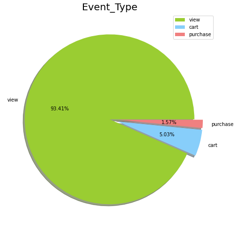
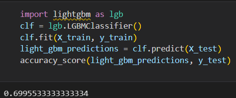
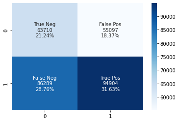
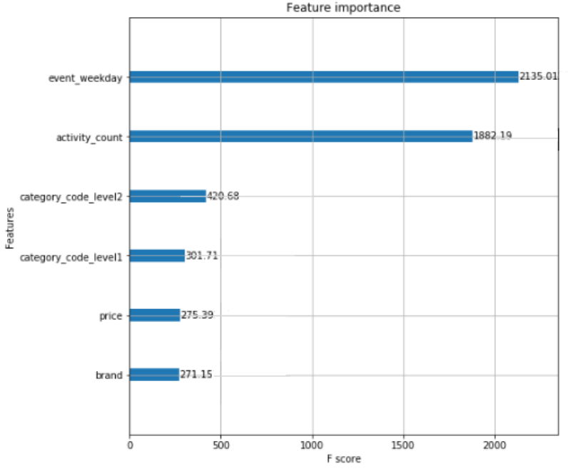
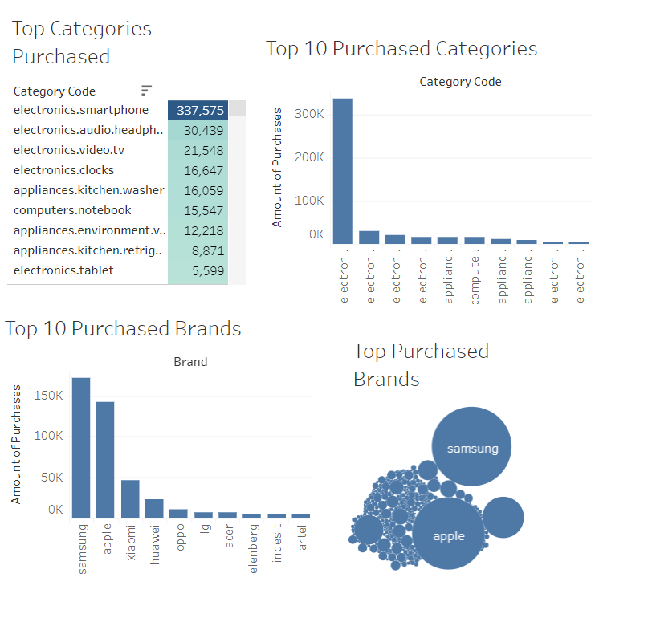

# Project Overview
E-commerce is a rapidly growing corner of the global consumer market. As more customers find it is easier to shop on their phones and computers, big box retailers are struggling to match the demand of their rapidly growing online counterparts. The behavior of an online consumer is different than that of an in-person shopper. The user is no longer restricted to the pervasive nature of a physical shopping cart. Instead, an online shopper has ability to shop at their own pace with the ability to add and remove items from their cart in an instant without the concern of any physical or social aspects of in-person shopping. The analysis of this project is centered around this change in the behaviors of the consumer. Our team will accurately advise market brands using the data we collected and visualize how these products compete with others on the digital market and what products consumers want in their carts.

# Links to Project Sections
- [Data Information](#data-information)
- [Data Analysis Progress](#data-analysis-progress)
- [Technologies Used](#technologies-used)
- [Database](#database)
- [Machine Learning Model](#machine-learning-model)
- [Tableau Visualizations](#tableau-visualizations)
- [Google Slides](#google-slides)

## Data Information

### Description of data source:

The source dataset comes from [Kaggle.com](https://www.kaggle.com/datasets/mkechinov/ecommerce-behavior-data-from-multi-category-store) from a large multi-category online store, collected by Open CDP project, and includes two CSV files with over 95 million values between the two files.  The features of the two tables are: 

- event_time – Stored as UTC datestamp
- event_type - Event type: one of [view, cart, remove_from_cart, purchase]
- product_id – Unique product ID
- category_id – Unique category ID
- category_code – Description of a product and category
- brand – Brand name of product
- price – In USD ($)?
- user_id – Permanent user ID
- user_session – session based on user ID

The focus of our analysis will be around event_type, product_id, category_code, and brand.

### Question to Answer with Data

Whether a user will purchase an item placed in their cart.

## Data Analysis Progress

### Exploration and Analysis of Data

Going through the columns in the data and determining what are the columns needed to answer the question we want answered.

Sorting out how many views were made of items, how many times items were added to a user’s cart, and how many times items were purchased.

In analyzing the data, we found the top 5 brands purchased in the month of November:

## Technologies Used

- Python
- Pandas
- AWS
- Tableau
- Jupyter Notebook
- Postgres SQL (pgAdmin)
- Google Slides

## Database

The initial datasets were first downloaded from Kaggle, and then read into a data frame using pandas. The team then transformed the files for October and November by splitting the tables based on the event_type column, creating three new tables for each month. With the dataset split, we were able to load the newly created tables into pgAdmin for further analysis using SQL.

### ERD

### Join Statement in pg Admin

## Machine Learning Model

We are using the Logistic Regression machine learning model, a part of the sklearn library.

Logistic Regression was chosen because the question we are trying to answer is a yes or no which Logistic Regression provides; answering whether a user will or won’t purchase an item when placed in their cart. It only provides a yes or no answer, but easy to implement.

The data was split into training and testing sets through a few different parameters. With X holding the columns 'price', 'event_weekday', and 'activity_count' and y holding the 'is_purchased' column. The 'is_purchased' column is key in answering the question the team has set out to answer: whether a user who places an item in their cart will purchase it.

The model was trained with the LogisticRegression class from the sklearn.linear_model library. The accuracy percentage first achieved was approximately 53%. After adding the lightgbm gradient boosting framework, the accuracy percentage increased to nearly 70%.

To get an idea of the accuracy of the model, a confusion matrix was used:

The confusion matrix shows the number of truly accurate results (31.63%), truly negative results (21.24%), and those that are falsely labeled either negative (28.76%) or positive (18.37%).

Given more time, the team would have liked to improve the accuracy of the model through more training, and possibly taking data from other months.  Currently, the accuracy of the model only sits at 57.3%.

### Description of Data Preprocessing

The initial datasets were first downloaded from Kaggle, and then read into a data frame using pandas. The dataset for November was then transformed into training data for our machine learning model, and then loaded into our model for testing.

### Description of Features

To predict whether the product added to the cart is actually purchased by the customer based on factors such as its category, event_weekday, and actiity of the user in that session, we need new features in training data:

- category_code_level1 - category
- category_code_level2 - subcategory
- event_weekday - weekday of the event
- activity_count - no. of activity in that session
- is_purchased - whether the put-in cart item is purchased

The training dataset contains every non-duplicated cart transaction with above mentioned features. We will use these features with their original price and brand to predict whether the customer will eventually purchase the item in the cart.

## Tableau Visualizations

https://public.tableau.com/app/profile/adam.joy3740/viz/TopBrandsCategoriesDashboard/Dashboard1
https://public.tableau.com/app/profile/adam.joy3740/viz/Cart_oct_2019/Sheet1?publish=yes

## Google Slides
[E-Commerce Analysis Presentation](https://docs.google.com/presentation/d/1OEXk-PdzL35VCIkZmoJKg7Pm75DpVYqanqhUKytyYg0/edit?usp=sharing)
